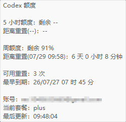
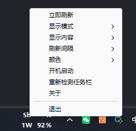

# CodexQuotaTaskbar

在 Windows 11 任务栏中直接查看 Codex 剩余额度，无需打开网页或额外窗口。

<p align="center">
  
</p>

> 百分比表示剩余额度。当前上游未返回 5 小时额度时，`5h` 会显示 `--%`，周额度仍可正常显示。

## 功能一览

- 原生嵌入 Windows 11 主任务栏，不使用悬浮窗
- 显示 5 小时额度与周额度，支持单行或上下两行
- 只显示一个额度时，可选择隐藏前面的 `5h` / `1W` 标识
- 悬停查看重置时间、可用重置次数及最早到期时间、账号套餐和最后更新时间
- 右键即可刷新、调整显示内容、刷新间隔和颜色
- 支持当前 Windows 用户开机启动
- 全屏游戏或截图遮罩出现时不重挂、不挪位，后台额度刷新继续
- 与 TrafficMonitor 等任务栏工具共存时保持稳定位置，仅在持续碰撞后原位向左避让
- 只读使用现有 Codex 登录状态，不收集遥测

<p align="center">
  
  
</p>

## 下载与运行

### 方式一：直接下载 EXE

1. 点击 [直接下载 `CodexQuotaTaskbar-v0.1.4-win-x64.exe`](https://github.com/zHysie/CodexQuotaTaskbar/releases/download/v0.1.4/CodexQuotaTaskbar-v0.1.4-win-x64.exe)。
2. 将下载的 EXE 保存或移动到一个固定目录。
3. 双击运行，程序会直接出现在主任务栏中。

### 方式二：下载完整压缩包

1. 下载 [`CodexQuotaTaskbar-v0.1.4-win-x64.zip`](https://github.com/zHysie/CodexQuotaTaskbar/releases/download/v0.1.4/CodexQuotaTaskbar-v0.1.4-win-x64.zip)。
2. 解压到固定目录，不要直接在压缩包内运行。
3. 双击解压后的 `CodexQuotaTaskbar.exe`。

如需随 Windows 登录自动启动，在右键菜单中开启“开机启动”。

开机登录时如果 Explorer 的任务栏、通知区或任务按钮树尚未完全就绪，程序会先在后台进行有上限的静默重试；就绪后正常附着，不会因为第一次探测过早而立即弹错退出。明确不支持的任务栏布局或空间不足仍会直接提示原因。

运行环境：Windows 11 x64，目标电脑需安装 Microsoft Visual C++ 2015–2026 x64 运行库。

v0.1.4 暂无安装器、自动更新和代码签名。Windows 可能显示“未知发布者”或 SmartScreen 提示，请只从本仓库 Release 下载并核对 SHA-256。

## 使用说明

默认上下两行显示：

```text
5h 85%
1W 72%
```

悬停会显示额度重置倒计时、可用重置次数及最早到期时间（本地时间，精确到分钟）、账号、套餐和最后成功更新时间；其余到期时间不展开。左键无操作；右键可立即刷新、切换显示模式、选择显示项目、修改刷新间隔和颜色、设置开机启动、重新检测任务栏或退出。

只显示一个额度时，「显示内容」子菜单中的「单项时显示标识（5h / 1W）」可选择是否显示前缀，默认开启。关闭后只留空标签列，数值和 `%` 不居中、不改变窗口宽度或 HWND；同时显示两种额度时该选项置灰，两个标签始终显示。该偏好会保存，旧版配置继续使用默认开启行为。

全屏游戏、浏览器全屏或截图遮罩出现时，程序暂停任务栏软布局调整，不销毁额度窗口，也不改变其位置；后台额度刷新仍继续。任务栏由系统自动隐藏时，额度窗口随任务栏隐藏，恢复后由同一个窗口在原位置出现。TrafficMonitor 等外部任务栏工具短暂显隐或缩小时不会让额度窗口向右跳动；只有连续 3 次、每次间隔 2 秒都确认真实碰撞时，才使用同一个窗口向左避让。

麦克风等系统状态按钮使通知区临时变宽时，额度窗口仍会安全避让；按钮消失、通知区收缩后，最右安全位置连续稳定 1 秒即使用同一 HWND 自动复位。TrafficMonitor 等外部顶层工具消失仍不会触发向右回抢。

升级时先退出软件，再解压并覆盖原文件。卸载时先关闭“开机启动”并退出，然后删除程序目录；如需同时清除设置，可删除 `%APPDATA%\CodexQuotaTaskbar\`。

## 隐私与数据安全

程序按以下顺序只读查找登录文件：

1. `%CODEX_HOME%\auth.json`（仅当 `CODEX_HOME` 已设置）
2. `%USERPROFILE%\.codex\auth.json`

程序不写回或自动刷新 Token，不调用重置机会消费接口，不记录请求头、完整响应、Token 或邮箱，也不收集遥测。网络访问严格限制为：

```text
https://chatgpt.com/backend-api/wham/usage
https://chatgpt.com/backend-api/wham/rate-limit-reset-credits
```

这两个地址属于未公开后端接口，没有长期稳定性承诺；上游接口变化时，部分额度可能暂时显示为 `--%`。

## 支持范围与已知限制

v0.1.4 在 Windows 11 build `22631.6199`、96 DPI、单显示器 1920×1080 环境完成本机构建、CTest 6/6、任务栏/稳定性/交互/生命周期探针，以及单/双额度、单双行、重启持久化、全屏、截图遮罩、任务栏自动隐藏和 Explorer 重启的真实桌面验证。正式构建门槛以 Windows 2022 / VS2022 GitHub Actions 为准。

本机未安装 TrafficMonitor，产品负责人明确豁免 v0.1.4 的本轮复核，相关兼容性只保留 v0.1.2 的历史结果。Win+Shift+S 直接路径本轮通过 8/10，另外 2 轮使用 SnippingTool Ctrl+N 真实截图遮罩补测通过。

v0.1.3 已完成 CTest 6/6、碰撞测试 32/32，并由用户在真实桌面确认麦克风状态按钮出现时安全避让、消失后约 1 秒自动复位且 HWND 保持不变。其余支持范围继续沿用下述 v0.1.2 已验证基线，未重新执行的组合不扩大承诺。

v0.1.2 已在 Windows build `10.0.26200.8894`、100% DPI、单显示器 2560×1440、底部任务栏环境完成 VS2022 x64 Release、CTest 6/6、碰撞测试 27/27、任务栏探针、交互探针 21/21 和生命周期探针验证。自动全屏、PrintScreen、真实截图遮罩与 Edge F11 各完成 10/10 轮；TrafficMonitor 连续 300 秒 9662 个样本及任务按钮增减 18 秒 580 个样本的 HWND、父子关系、坐标和可见性异常计数均为 0。

任务栏自动隐藏后同一 HWND 在原坐标 69 毫秒内恢复；Explorer 重启时应用 PID 和实例数保持不变，6.654 秒内只重附着一次。本机 `ms-screenclip` 关联损坏导致 Win+Shift+S 弹出“打开方式”，因此改用 SnippingTool Ctrl+N 的真实截图遮罩完成 10/10 轮验证。未验证具体游戏；125% / 150% / 200% DPI、双显示器和睡眠恢复本轮未复核，只保留历史结果；干净 Windows 用户环境和其他 Windows 11 内部版本尚未完成真实验证。

## 从源码构建

需要 Visual Studio 2022 Build Tools、“使用 C++ 的桌面开发”、CMake 和 Windows SDK。在仓库根目录运行：

```powershell
.\build.cmd
```

正式程序位于 `build\Release\CodexQuotaTaskbar.exe`，构建脚本会同时运行全部 CTest。

## 许可证

项目采用 [MIT License](LICENSE)。第三方依赖与许可证见 [THIRD_PARTY_NOTICES.md](THIRD_PARTY_NOTICES.md)。
